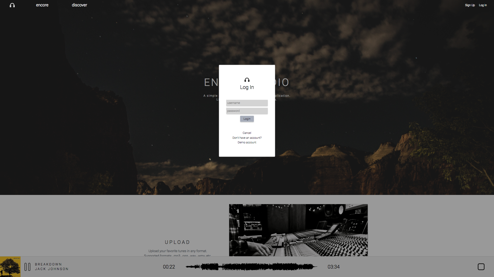
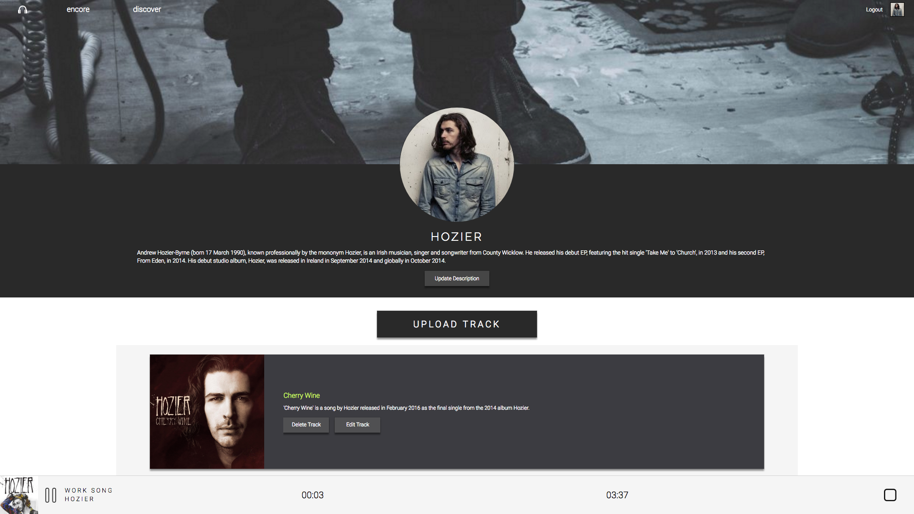
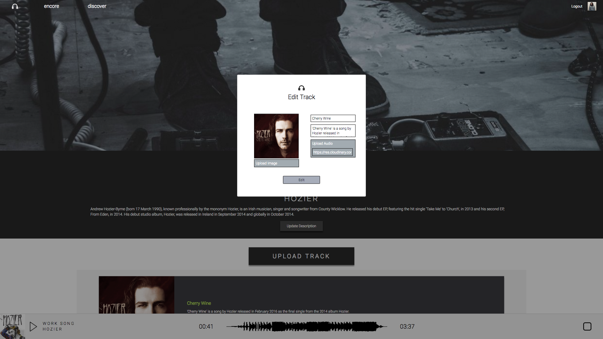
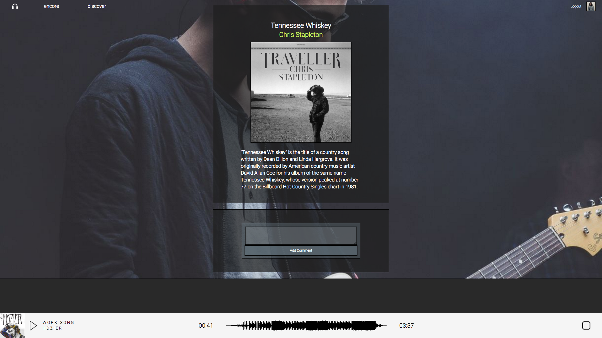

# Encore Audio

[Encore][encore] is a full-stack web application inspired by [SoundCloud][soundcloud],
and is built on Ruby on Rails and React.js/Redux. Encore allows users to create,
stream, and share their music.

Encore is a personal project by Kevin Nguyen.

[encore]: http://www.encore-audio.us
[soundcloud]: http://soundcloud.com

## Features

### User accounts with secure authentication

### Discover page displaying tracks

### User pages showing all tracks uploaded by a user

### Audio uploading and management

### Continuous music streaming with waveform

### Track pages showing details and comments

## Project Design

### Non-User Features
It was important to allow non-users to view and browse music as they
scan the site. This prevents 'lock-out' apathy and allows a high-level
of interaction without ever signing up. Hopefully, this concept will
help increase throughput and traffic.

>Immediate future plans:
- Allow visitors to search for users or tracks

### User Features
With so much interaction available to non-users already, an important
distinction needed to be made to incentivize signing up.

>Immediate future plans:
- Allow users to create, view, and share playlists
- Allow users to queue tracks
- Allow users to like/favorite tracks

### Technical Design

More information can be found in the [development readme](./docs/README.md)
and [documentation](./docs).

## Notable Technology

>### Backend
- Encore runs on Ruby on Rails and is hosted on Heroku. The backend is
essentially just a web server and provides APIs for interacting with
our database.
- Heroku utilizes a NewRelic APM (application performance management) to
track uptime and periodically ping the heroku dyno, keeping it awake for
quicker response.
- PostgreSQL was our database implementation of choice and is easy to
integrate with Heroku hosting.
- BCrypt was utilized for password-salting and hashing for a secure
authentication system.

>### Frontend
- Encore utilizes the React.js framework following a Redux implementation
to deliver a responsive single-page application.
- NPM and Webpack were our choices for managing packages and bundling
the React components.
- jQuery was used for managing AJAX API requests to our back-end, but was
used very sporadically for DOM manipulation. Most DOM manipulation was
handled by vanilla methods.
- Cloudinary was used for both audio and image storage. The web service
also allows for the creation of waveforms based on audio tracks.
